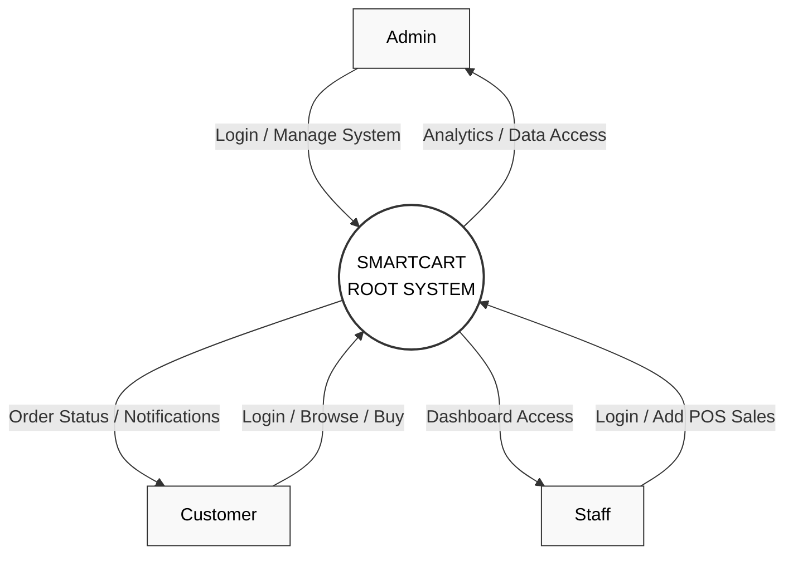
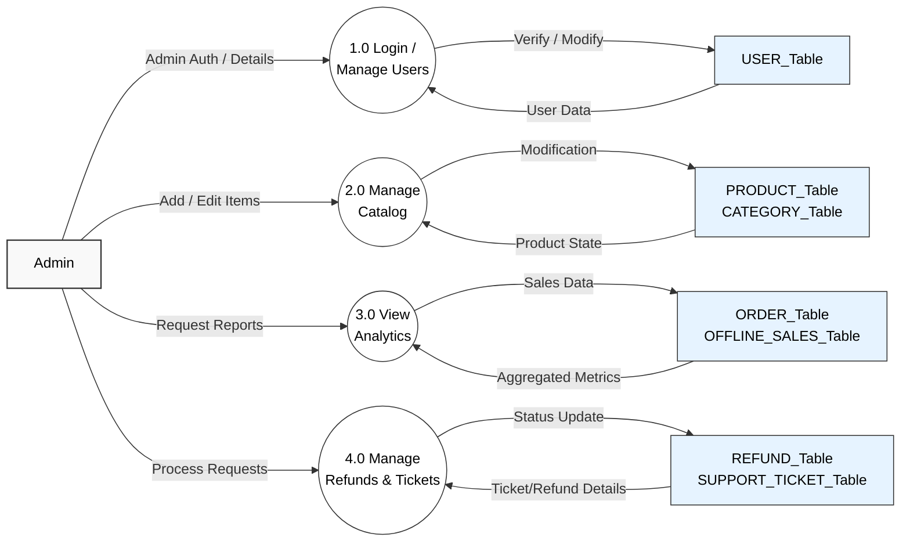
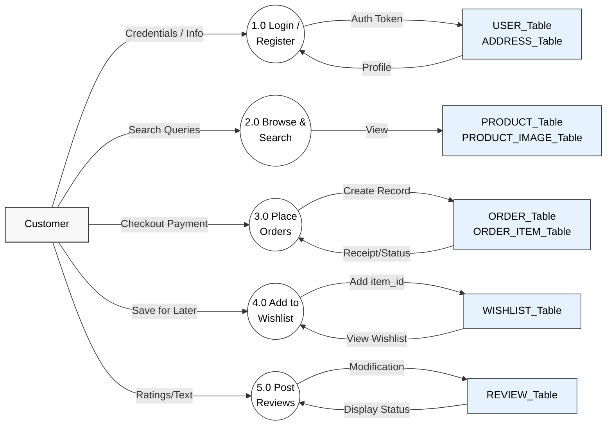
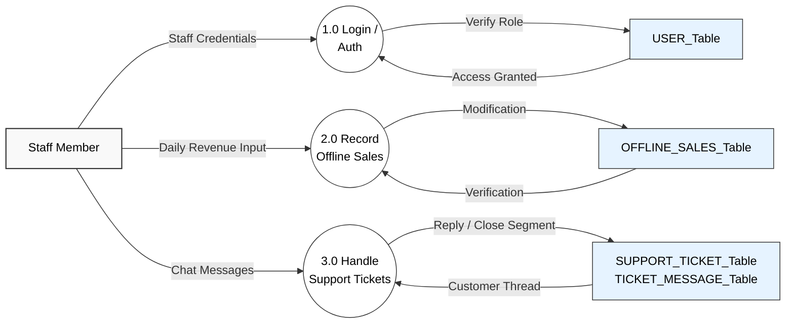

# SmartCart Admin Analytics - Data Flow Diagrams

These diagrams map the entities, processes, and tables for the finished project based on `models.py`. 
*Note: If your viewer doesn't support Mermaid, you can copy the code blocks into a viewer like [Mermaid Live](https://mermaid.live)*.

## 1. Level-0 Context Diagram
This diagram shows the main entities (Admin, Customer, and Staff) interacting with the core SmartCart system.

## 2. Level-1 DFD: Admin (System Administrator)
This maps exactly what the Admin can do and which database tables those actions talk to.

## 3. Level-1 DFD: Customer (Shopper)
This maps the standard user journey on the frontend and the tables involved.

## 4. Level-1 DFD: Staff (In-Store Agent/Support)
This covers the offline sales entry and replying to support queries.

